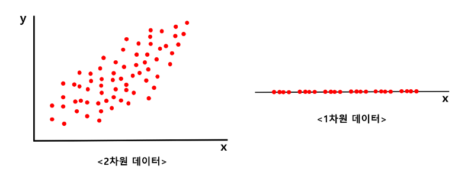

## PCA ### 

PCA is a representative method of **dimensinoality reduction ** and is often utilized in machine learning, data mining, statistical analysis, noise removal etc. 

In layman's terms PCA reduced multi-dimensional data into a lower dimension. The question is: how? 

For instance let's say we want to reduce the dimension of a two dimesnsional data into a single dimension. We obviously can't preserve all the features and characteristics. We must still attempt to preserve as much information as we can. A method tthat enables us to do this is **PCA**.

 

### The intuition behind PCA 

